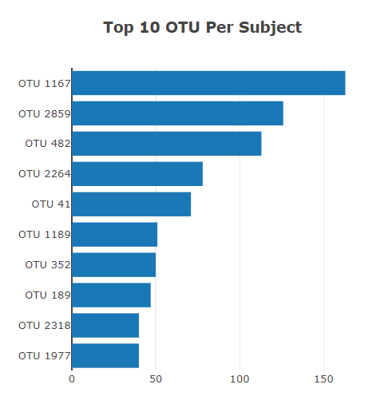
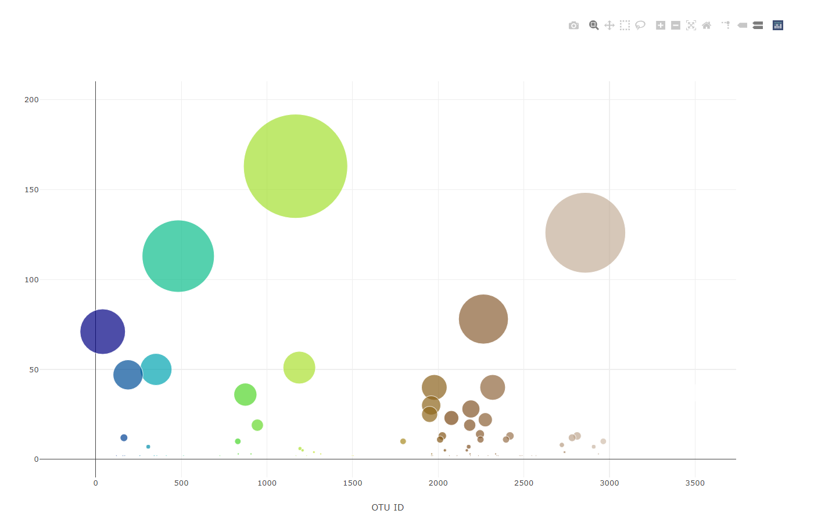
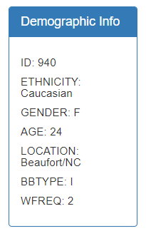
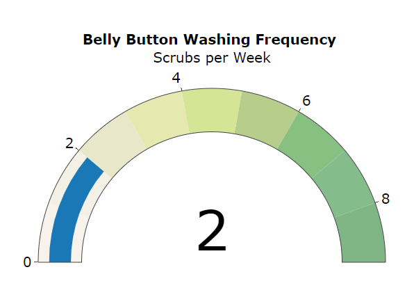
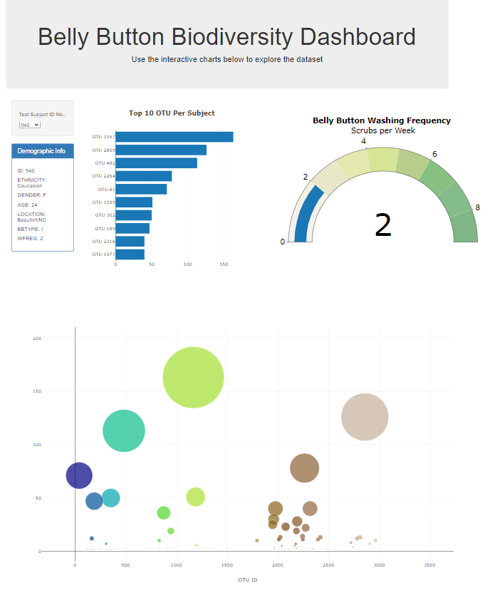

# plotly-challenge
Week 15 - Homework


In this assignment, I built an interactive dashboard to explore the Belly Button Biodiversity dataset, which catalogs the microbes that colonize human navels.

The dataset reveals that a small handful of microbial species (also called operational taxonomic units, or OTUs, in the study) were present in more than 70% of people, while the rest were relatively rare.

## Assignment structure
```
plotly-challenge
|__ .gitignore                           # Gitignore file
|__ README.md                            # Markdown README
|__ index.html                           # HTML
|  |__ data/                             # Dataset
|       |__ samples.json                 # JSON dataset
|  |__ images/                           # png screenshots
|       |__ bacteria.jpg                 # png
|       |__ bubbleChart.png              # png
|       |__ dashboard.PNG                # png
|       |__ demographicInfo.PNG          # png
|       |__ gaugeChart.png               # png
|       |__ horizontalBarChart.PNG       # png
|__ static/                              # Static directory
|    |__ js/                             # JavaScript directory
|        |__ app.js                      # JavaScript file

```


## Usage

```
HTML
* <!DOCTYPE html>
* <html lang="en">

D3
* <script src="https://cdnjs.cloudflare.com/ajax/libs/d3/5.9.7/d3.min.js"></script>

Plotly
* <script src="https://cdn.plot.ly/plotly-latest.min.js"></script>

JavaScript
* <script src="./static/js/app.js"></script>

JSON
* <script src="samples.json"></script>

```

## Datasets 

|No|Source|Link|
|-|-|-|
|1|index.html|https://github.com/alysnow/plotly-challenge/blob/main/index.html|
|2|samples.json|https://github.com/alysnow/plotly-challenge/blob/main/data/samples.json|
|3|app.js|https://github.com/alysnow/plotly-challenge/blob/main/static/js/app.js|


## Plotly

### Horizontal Bar Chart - Top 10 OTU Per Subject

Created a horizontal bar chart with a dropdown menu to display the top 10 OTUs found in an individual using the D3 library to read in samples.json.

The following has been applied to the chart;

* sample_values applied as the values for the bar chart.

* otu_ids applied as the labels for the bar chart.

* otu_labels applied as the hovertext for the chart.




### Bubble Chart - Samples

Created a bubble chart that display each sample using the D3 library to read in samples.json.

The following has been applied to the chart;

* otu_ids applied for the x values.

* sample_values applied for the y values.

* sample_values applied for the marker size.

* otu_ids applied for the marker colors.

* otu_labels applied for the text values.




### Demographic Information

Displayed the sample metadata for an individual's demographic information. Plots update when a new sample is selected.




### Gauge Chart

Created a guage chart to display the weekly belly button washing frequency of an individual. Chart updates when a new sample is selected.




## Dashboard

Below is an overview of the Belly Button Diversity Dashboard which contains all the interactive charts which explores the dataset.

The Dashboard can be accessed at the following [link] (https://alysnow.github.io/plotly-challenge/).




## Contributor
- [Alysha Snowden](https://github.com/alysnow)